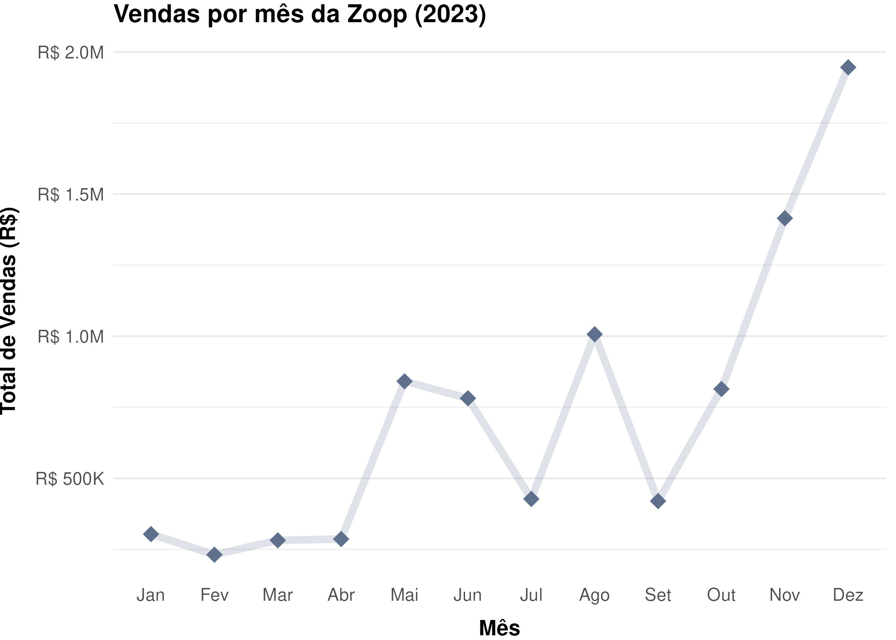
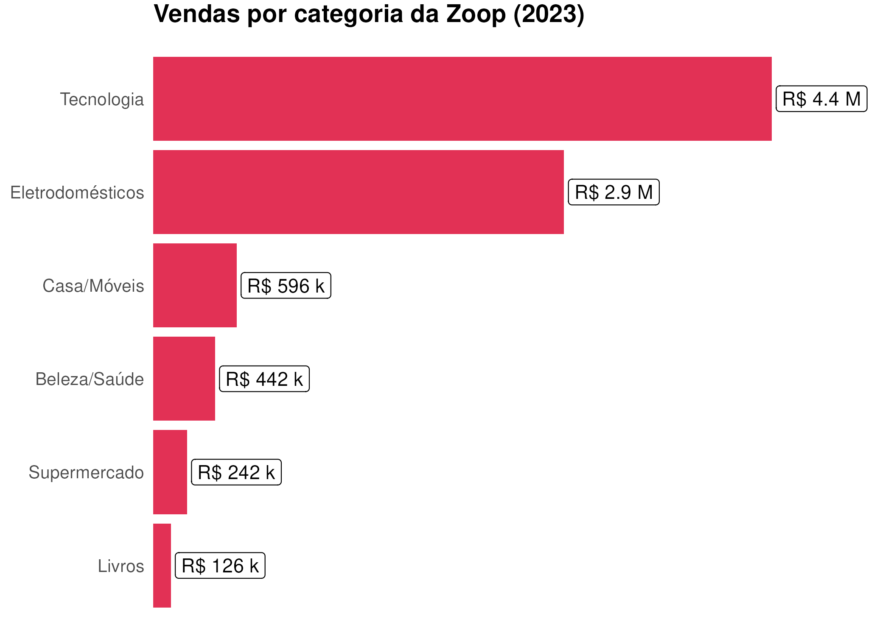
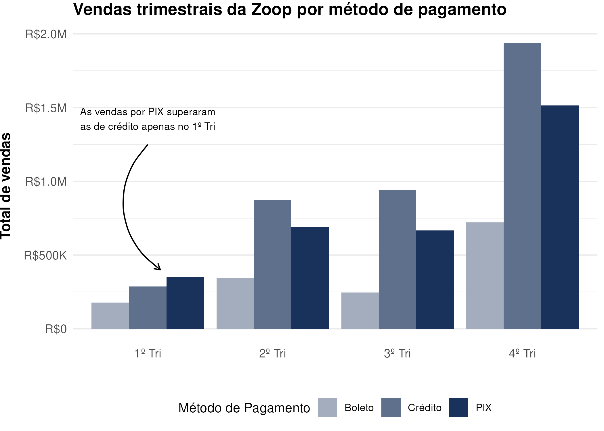

# data_viz_r

# Análise de Vendas - Visualização de Dados com R

Este projeto utiliza a linguagem R para realizar uma análise de vendas de uma loja fictícia. A análise abrange visualizações interativas e estáticas para entender o desempenho de vendas por mês, categoria de produtos e trimestre, segmentado por tipo de pagamento.

## 🛠️ Ferramentas Utilizadas
- **R**: Linguagem principal do projeto.
- **Pacotes R**: `ggplot2`, `dplyr`, `tidyverse`, entre outros.
- **Dados fictícios**: Criados para simular vendas da loja.

## 📊 Visualizações Disponíveis
### 1. Vendas por Mês

### 2. Vendas por Categoria

### 3. Vendas por Trimestre por Tipo de Pagamento

